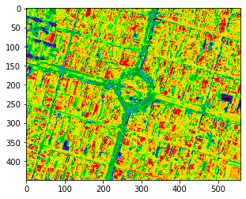
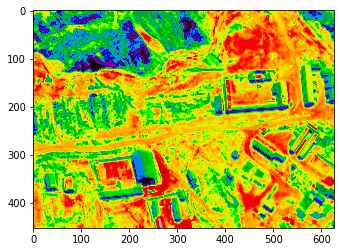
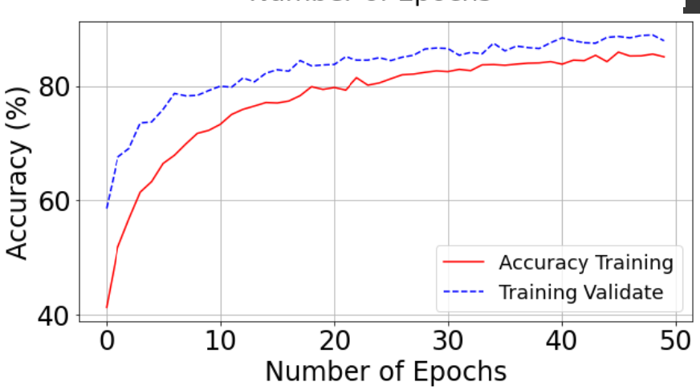

# Poverty Bolivia Prediction

<p align="center">
	 
	 
	 
	
</p>

## Project Overview

Poverty eradication is a key challenge of the UN’s Sustainable Development Goals. In Bolivia, around 34% of the population (~3M people) lived in poverty in 2020, yet current data collection methods like censuses are expensive and infrequent.

This project proposes a machine learning approach using satellite imagery to estimate poverty in Bolivia, focusing on La Paz as a representative area. Images were collected from Google Static Maps (RGB), and a ResNet-50 model was used to classify areas into three levels of poverty using unsatisfied basic needs (UBN) surveys.

### Results

The models classify poverty into three levels: low, medium, and high. The best prediction results after several tests are summarized below:

| Category | Model A Accuracy | Model B Accuracy |
|----------|-----------------|-----------------|
| Low      | 0.814           | 0.529           |
| Medium   | 0.230           | 0.856           |
| High     | 0.972           | 0.795           |

<ul>
	<li>  <b>Model A</b> (trained on a balanced dataset) performs best in the low and high poverty categories. </li>
	<li>  <b>Model B</b> achieves higher accuracy in the medium poverty category. </li>
</ul>

 This approach is cost-effective, scalable, and fully based on public data, offering a practical tool for demographic, social, and statistical studies.

### Visual Results

### 1. Satellite Image Examples by Poverty Level


  |  |  |

*Examples of satellite images for each poverty level (low, medium, high) used in the model.*

### 2. Model Training Performance

**Accuracy During Training**



*Graphs showing the model's accuracy and loss throughout the training process.*
---

This project predicts poverty levels in Bolivia using deep learning, with a focus on convolutional neural networks (CNNs) and the ResNet architecture. The repository contains Jupyter notebooks for model training, evaluation, prediction, and visualization. 

## Installation

1. **Clone the repository:**
	```bash
	git clone https://github.com/GriselQ23/Poverty_Bolivia_prediction.git
	cd Poverty_Bolivia_prediction
	```
2. **(Optional) Create a virtual environment:**
	```bash
	python3 -m venv venv
	source venv/bin/activate
	```
3. **Install dependencies:**
	```bash
	pip install -r requirements.txt
	```

## Usage

Open the Jupyter notebooks (`.ipynb` files) in your preferred environment (Jupyter Lab, Jupyter Notebook, or VS Code). Run the cells in the following notebooks as needed:

- `Training.ipynb`: Model training using ResNet and CNNs.
- `Prediccion_y_evaluacion.ipynb`: Model prediction and evaluation.
- `Prediccion.ipynb`: Additional prediction utilities.
- `Visualize_filters.ipynb`: Visualization of CNN filters.
- `Interfaz.ipynb`: Graphical interface for predictions (Tkinter-based GUI).

## Dependencies

All dependencies are listed in `requirements.txt`. Main packages include:

- numpy
- tensorflow
- keras
- pillow
- matplotlib
- visualkeras
- scipy
- pandas
- scikit-learn
- notebook
- tkinter (for GUI, usually included with Python)

## Notes
- Some notebooks may require downloading datasets or pre-trained models. Please refer to the notebook instructions for details.
- For best results, use Python 3.7 or higher.

## License
This project is for academic and research purposes.


